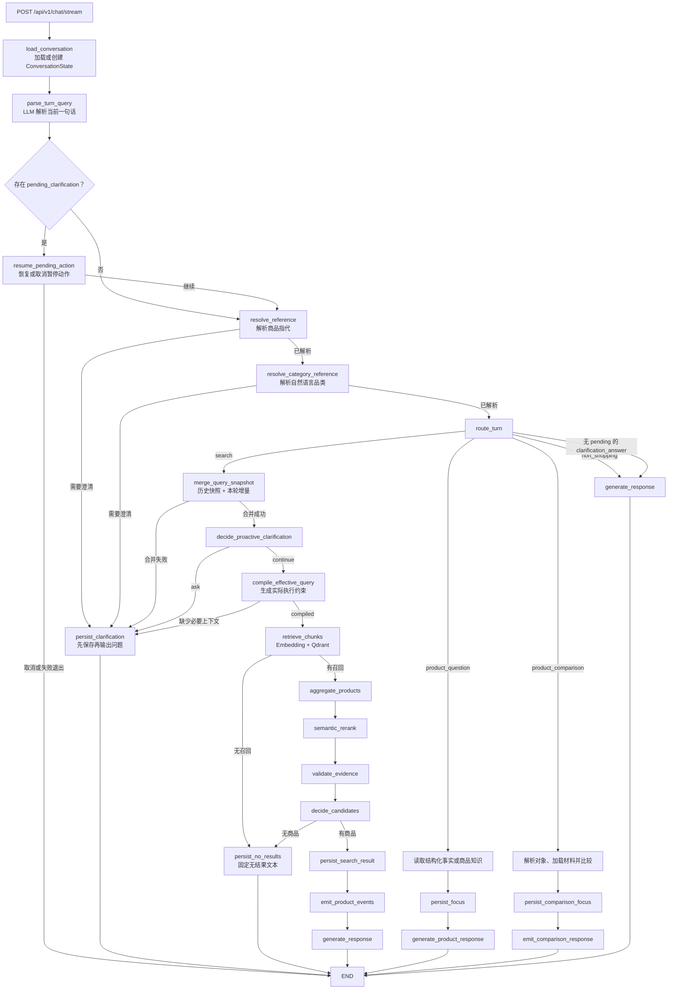
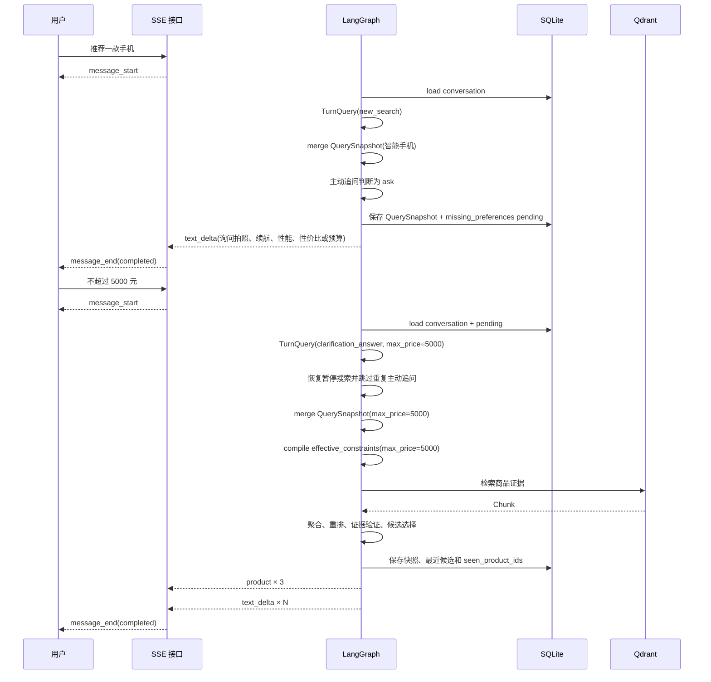

# 多轮购物工作流生命周期与状态设计

> 本文说明当前生产工作流。重点是一次请求如何进入 LangGraph、会话状态如何跨轮保存、
> 搜索条件如何从本轮增量变成实际执行约束，以及主动追问和性价比价格编译位于哪一层。
>
> [单轮商品推荐系统设计说明](single-turn-shopping-system-design.md)记录的是早期单轮架构，
> 其中 RAG、SKU 事实边界和 SSE 设计仍有参考价值，但“系统只实现单轮对话”“图状态
> 不承担会话记忆”等描述不再代表当前实现。

相关功能文档：

- [单轮文本商品推荐工作流](../features/text-shopping-workflow.md)
- [多轮 Query 编译、稳定条件细化与指代消解](../features/multi-turn-query-engine.md)
- [Agent 主动需求澄清](../features/proactive-requirement-clarification.md)
- [多商品对比决策](../features/multi-product-comparison.md)
- [跨品类商品约束与 SKU 匹配](../features/cross-category-shopping-constraints.md)

## 当前系统维护两种生命周期

一次聊天请求会创建临时的 `ShoppingState`，同一个 `conversation_id` 则对应一份持久化的
`ConversationState`。这两个对象相互传递数据，但用途不同。

| 对象 | 负责什么 | 存活时间 | 是否写入 SQLite |
|---|---|---|---|
| `TurnQuery` | LLM 对当前一句话的增量解析 | 当前请求 | 默认不保存；进入澄清时可放入 pending |
| `ShoppingState` | LangGraph 当前请求的运行状态 | 当前请求 | 否 |
| `QuerySnapshot` | 当前购物任务已经累计的完整查询条件 | 跨请求 | 是，作为 `ConversationState` 的字段 |
| `ConversationState` | 查询快照、最近候选、焦点、已展示商品和 pending | 整个会话 | 是 |
| `ConversationRecord` | 持久化状态及其乐观锁版本 | 整个会话 | 版本和状态分别保存 |
| 日志事件 | 记录路由、合并、约束编译和保存结果 | 由日志系统决定 | 不属于会话状态 |

`QuerySnapshot` 不是 `ConversationState` 的别名，而是其中一个字段：

```text
ConversationRecord
├── version
└── state: ConversationState
    ├── schema_version
    ├── conversation_id
    ├── query_snapshot: QuerySnapshot | null
    │   ├── category
    │   ├── sub_category
    │   ├── semantic_terms[]
    │   └── constraints
    ├── recent_candidates[]
    ├── focused_product_id
    ├── seen_product_ids[]
    └── pending_clarification
```

SQLite 表只保存一行版本化会话记录：

```text
conversation_state
├── conversation_id TEXT PRIMARY KEY
├── version INTEGER NOT NULL
├── state_json TEXT NOT NULL
└── updated_at TEXT NOT NULL
```

`state_json` 是完整 `ConversationState` 的序列化结果。Qdrant Chunk、重排结果、模型原始
输出和整个 `ShoppingState` 都不会写入这张表。更新时使用 `expected_version` 做乐观并发
控制，旧请求不能覆盖已经被其他请求写入的新状态。

## 一次请求从 SSE 开始和结束

`POST /api/v1/chat/stream` 为每次请求创建 `request_id`。客户端可以传入
`conversation_id`，未传时由服务端生成。接口先发送 `message_start`，再运行工作流；
图节点可以发送 `product` 或 `text_delta`，接口最后发送 `message_end`。

```text
message_start
  -> LangGraph 工作流
       -> product * 0..3
       -> text_delta * 0..N
       -> error * 0..1
  -> message_end
```

同一个 `conversation_id` 负责跨请求恢复会话；`request_id` 只标识本次执行。正常完成、
商品已经发送但文案失败、整体失败分别对应 `completed`、`partial` 和 `failed`。

## 当前生产图



图中“先保存再输出”是会话一致性要求。客户端一旦看到追问或商品卡片，下一轮就可能
立刻到达，因此 pending、查询快照和最近候选必须先写入 SQLite。

## 本轮输入先变成 `TurnQuery`

`parse_turn_query` 将原始消息连同当前会话上下文交给 `DashScopeTurnQueryParser`。上下文
只包含当前决策需要的紧凑状态：`query_snapshot`、最近候选摘要、焦点商品和
`pending_clarification`，不会把完整历史消息直接拼接进提示词。

模型输出的 `TurnQuery` 描述本轮变化。主要意图包括：

| `TurnQuery.intent` | 含义 |
|---|---|
| `new_search` | 发起新的购物任务 |
| `refine_search` | 修改当前查询条件 |
| `switch_category` | 切换品类 |
| `more_results` | 保持条件继续换一批 |
| `product_question` | 询问最近某款商品 |
| `product_comparison` | 比较最近展示的商品 |
| `clarification_answer` | 回答上一轮澄清 |
| `non_shopping` | 非购物输入 |

预算、品牌、SKU 和数值条件以 `slot_operations` 表达；“拍照优先”这类召回偏好以
`semantic_term_operations` 表达。模型不负责把历史条件重新完整输出，也不直接决定最终
商品 ID。

## pending 在正式路由前恢复

`pending_clarification` 表示上一次请求留下了一项尚未完成的动作。它保存澄清类型、
必要的候选范围、被暂停的 `TurnQuery` 和尝试次数。当前类型包括商品或品类歧义、缺少
上下文、条件冲突、对比对象或维度不足，以及主动需求澄清使用的
`missing_preferences`。

下一轮加载会话后，`resume_pending_action` 处理四种结果：

- 用户取消，清除 pending、保存状态并结束本轮。
- 用户明确发起新搜索，废弃旧 pending，执行新搜索。
- 用户给出 `clarification_answer`，将回答增量合并到暂停的 `TurnQuery`，再回到引用解析和
  正常路由。
- 回答仍不能形成可执行动作，按对应澄清策略清理或退出，避免无限追问。

`missing_preferences` 恢复时还会在本轮 `ShoppingState` 写入
`skip_proactive_clarification=true`。这个标记只防止同一次搜索再次主动提问，不写入
`QuerySnapshot` 或 SQLite。

## `route_turn` 选择业务分支

实际路由函数读取 `TurnQuery.intent`，把四种搜索意图统一映射到 `search`，商品问答和
商品对比分别进入独立分支。`clarification_answer` 在存在 pending 时通常已经恢复成被暂停
的原始意图；没有 pending 的澄清回答才会走普通文本回复。

代码日志中的 `turn_route` 与路由函数不是同一个对象。路由函数决定条件边走向，日志事件
只记录 `intent`、指代线索、候选数量、最终 route 和澄清原因。删除日志不会改变路由。

## 搜索条件分两次编译

搜索分支有两个不同的编译阶段：

```text
TurnQuery 本轮增量
        +
ConversationState.query_snapshot 历史完整条件
        |
        v
merge_query_snapshot
        |
        v
QuerySnapshot 用户当前完整需求
        |
        v
compile_effective_query
        |
        v
effective_constraints 本次检索实际执行条件
```

### `merge_query_snapshot` 维护用户需求

该节点调用确定性 `merge_turn_query`，负责槽位增加、删除和覆盖，处理品类切换、相对价格、
近似价格、条件冲突以及搜索策略选择。成功后生成完整 `QuerySnapshot` 和可供旧检索链路
使用的 `ParsedIntent`。

例如，会话已有手机查询，本轮只有“不超过 5000 元”：

```json
{
  "old_snapshot": {
    "category": "数码电子",
    "sub_category": "智能手机",
    "constraints": {"max_price": null}
  },
  "turn_query": {
    "intent": "refine_search",
    "slot_operations": [
      {
        "slot": "constraints.max_price",
        "operation": "replace",
        "value": 5000
      }
    ]
  },
  "new_snapshot": {
    "category": "数码电子",
    "sub_category": "智能手机",
    "constraints": {"max_price": 5000}
  }
}
```

`query_snapshot_compiled` 是这个节点打印的日志事件，包含 `old_snapshot`、`new_snapshot`
和实际应用的操作摘要。真正参与后续执行的数据是
`ShoppingState["query_snapshot"]`，不是这条日志。

### `compile_effective_query` 生成执行约束

该节点读取由快照转换出的 `ParsedIntent.constraints`，生成
`ShoppingState["effective_constraints"]` 和可选的 `price_reference`。检索、Catalog
SKU 筛选、证据验证和候选选择统一读取这份生效约束。

`effective_query_compiled` 是节点执行完成后打印的日志，记录原始约束、生效约束、价格
参考和是否需要澄清。它不参与计算，不修改状态，也不会传给 Qdrant。

| 名称 | 类型 | 作用 |
|---|---|---|
| `compile_effective_query` | 工作流节点和确定性服务函数 | 真正计算并写入生效约束 |
| `effective_constraints` | `ShoppingState` 字段 | 下游检索和验证使用的数据 |
| `effective_query_compiled` | 日志事件 | 记录编译前后结果 |

## 主动追问位于两次编译之间

主动需求澄清必须查看已经合并的完整快照，因此位于 `merge_query_snapshot` 之后；它又不应
启动价格编译、Embedding 或 Qdrant，因此位于 `compile_effective_query` 之前。

```text
merge_query_snapshot
  -> decide_proactive_clarification
       -> ask
            -> PendingClarification(kind="missing_preferences")
            -> persist_clarification
            -> END
       -> continue
            -> compile_effective_query
            -> 检索链路
```

只有以下条件同时成立才会主动追问：搜索是 `new_search` 或 `switch_category`；品类已经
唯一解析为 Catalog 中的 `category + sub_category`；完整快照除类目外没有预算、品牌、
软偏好、feature、SKU 或数值条件；子品类商品数超过展示上限；该子品类有审核过的问题
策略；用户没有要求直接推荐。

问题来自按子品类维护的固定白名单。手机只会询问拍照、续航、性能、性价比或预算，不会
套用跑步鞋的尺码问题，也不会让模型临时生成“需要多少分辨率”一类错误问题。

## 性价比在生效约束编译阶段计算

用户表达“性价比优先”时，`QuerySnapshot` 只保存原始意图：

```json
{
  "constraints": {
    "price_preference": "value"
  }
}
```

Catalog 启动时按 `category + sub_category` 建立价格参考。每个商品贡献其最低 SKU 价格，
同组取中位数并乘以 `1.2`，得到该子品类的动态性价比上限。

```text
每个商品的最低 SKU 价格
  -> 子品类中位数
  -> 中位数 × 1.2
  -> computed_price_cap
```

`compile_effective_query` 应用以下规则：

- 没有 `price_preference="value"` 时，原约束直接成为生效约束。
- 存在性价比偏好时，使用 Catalog 的动态价格上限。
- 同时存在明确最高预算时，取明确预算和动态上限中的较小值。
- 明确最低价高于动态上限时，保留用户最低价，不强行应用统计上限，并记录
  `skip_reason="explicit_min_exceeds_computed_cap"`。
- 缺少精确品类或价格参考时，进入阻塞型澄清，不访问 Qdrant。

例如用户表达“拍照优先，预算 4000”：拍照进入 `semantic_terms`，作为召回和重排使用的
软偏好；4000 进入 `constraints.max_price`，作为 SKU 级硬约束。如果用户同时表达性价比，
且动态上限为 3600，本次 `effective_constraints.max_price` 为 3600；若动态上限为 4500，
则仍按用户预算 4000 执行。

`QuerySnapshot` 跨轮保存用户表达的条件，`effective_constraints` 每次请求根据当前 Catalog
重新计算。价格数据变化后不需要迁移会话快照。

## 检索、验证和持久化

`retrieve_chunks` 把 `effective_constraints` 放回当前 `ParsedIntent`，调用 Embedding 和
Qdrant。换一批和稳定细化可以通过 `seen_product_ids` 排除已展示商品，稳定细化还会补回
最近候选的精确商品证据。

召回结果按商品聚合并重排后，`validate_evidence` 使用相同的
`effective_constraints` 检查硬约束和开放语义条件，`decide_candidates` 再选择最终商品。
价格和规格必须由同一个 SKU 同时满足，商品卡片只发送匹配 SKU。

有结果时，`persist_search_result` 在发送商品事件前保存：

```text
query_snapshot        当前完整查询
recent_candidates     本轮即将展示的商品 ID、排名和展示价格
seen_product_ids      当前购物任务已经展示过的商品
focused_product_id    清空，等待后续商品问答重新建立
pending_clarification 清空
```

无结果时，`persist_no_results` 也会保存最新查询快照，并根据搜索意图决定是否保留上一批
候选。保存成功后才发送固定无结果文本。

## 非搜索分支

商品问答不重新合并查询快照。系统先在最近候选和焦点范围内确定唯一商品；价格、品牌、
SKU 等结构化问题直接读取 Catalog 和已发送价格快照，开放问题再按 `product_id` 从 Qdrant
读取商品证据。回答前保存新的 `focused_product_id`。

商品对比要求从最近候选中确定两到三款商品和比较维度。对象或维度不足时保存对应
pending；信息完整时加载商品材料、生成证据约束下的比较结论，并保存比较后的焦点商品。

非购物输入不修改现有购物快照。它只走普通文本回复，用户随后仍可继续原购物任务。

## “推荐手机，再补预算”的完整时序



第一轮在保存 pending 后结束，没有调用 Qdrant。第二轮恢复的是暂停的新搜索，不是把两句
原始文本简单拼接；预算操作进入完整快照后，后续继续复用同一套检索、SKU 过滤、证据
验证和回复链路。

## 日志与状态对照

| 日志事件 | 对应动作 | 是否是可供后续节点读取的对象 |
|---|---|---|
| `turn_query` | 当前消息已解析为 `TurnQuery` | 否，真正对象是 `state["turn_query"]` |
| `turn_route` | 记录本轮意图最终走向 | 否 |
| `query_snapshot_compiled` | 记录快照合并前后和应用操作 | 否，真正对象是 `state["query_snapshot"]` |
| `effective_query_compiled` | 记录原始约束、生效约束和价格参考 | 否，真正对象是 `state["effective_constraints"]` |
| `conversation_persisted` | 记录 expected/saved version 和保存类型 | 否，真正持久化结果是 `ConversationRecord` |

这些日志用于回答“这一轮为什么走到这里”。业务正确性由 Pydantic 模型、确定性合并器、
工作流条件边和 SQLite 保存结果保证，不能依赖日志继续执行。

## 代码入口

| 职责 | 文件 |
|---|---|
| HTTP 与 SSE 生命周期 | `src/shop_agent/api/chat.py` |
| LangGraph 节点和条件边 | `src/shop_agent/workflow/graph.py` |
| 节点实现与日志事件 | `src/shop_agent/workflow/nodes.py` |
| 本轮增量协议 | `src/shop_agent/models/turn_query.py` |
| 会话、快照和 pending 模型 | `src/shop_agent/models/conversation.py` |
| 本轮图状态 | `src/shop_agent/models/state.py` |
| SQLite 会话仓库 | `src/shop_agent/services/conversation_repository.py` |
| 多轮快照合并 | `src/shop_agent/services/multi_turn_query_compiler.py` |
| 主动追问策略 | `src/shop_agent/services/proactive_clarification.py` |
| 性价比生效约束编译 | `src/shop_agent/services/query_compiler.py` |
| 商品事实和价格参考 | `src/shop_agent/catalog.py` |

