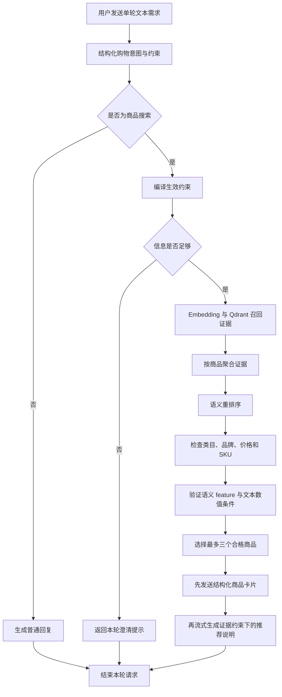
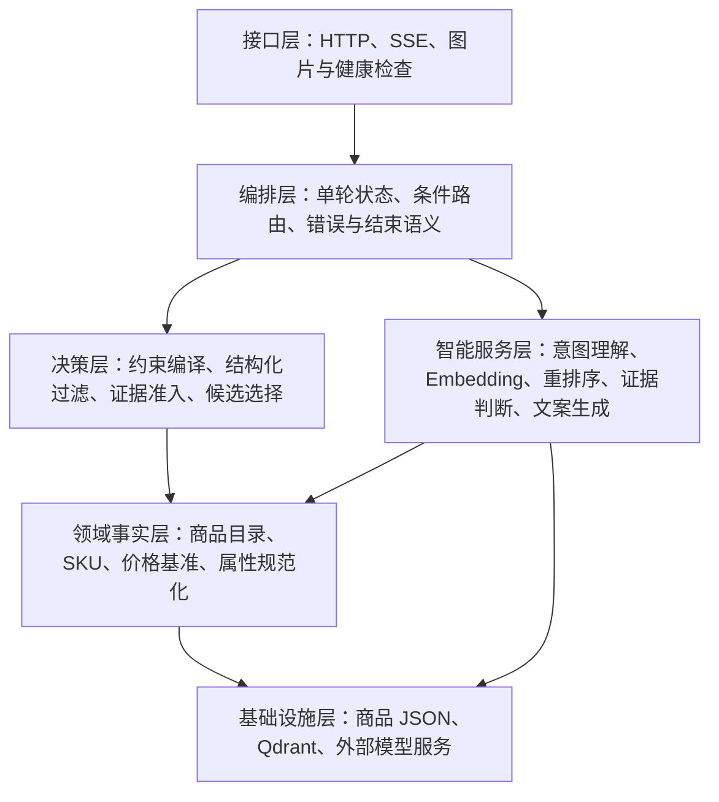

# 单轮商品推荐系统设计说明

> 历史说明：本文记录早期单轮架构。当前系统已经支持 SQLite 会话恢复、多轮查询快照、
> 指代消解、商品对比和主动需求澄清。现行生命周期见
> [多轮购物工作流生命周期与状态设计](multi-turn-shopping-workflow-lifecycle.md)。本文后续提到
> “只实现单轮对话”或“图状态不承担会话记忆”时，应按当时的实现背景理解。
>
> 本文面向系统设计讲解与面试交流，综合说明“单轮文本商品推荐工作流”和“跨品类商品约束与 SKU 匹配”两项能力。
>
> 当前系统只实现单轮对话。`conversation_id` 仅用于关联一次请求产生的流式事件，不保存历史消息，不继承上一轮条件，也不支持指代消解。

相关功能文档：

- [单轮文本商品推荐工作流](../features/text-shopping-workflow.md)
- [跨品类商品约束与 SKU 匹配](../features/cross-category-shopping-constraints.md)

## 一、系统解决什么问题

系统接收一句自然语言购物需求，例如：

- “推荐一款 500 元以内、佩戴舒服的蓝牙耳机。”
- “想买 8000 元以内、512GB、不要曲面屏的手机。”
- “我想买一瓶饮料，最好是能提神的。”

它需要从本地商品数据中找到真实候选，检查价格、品牌、SKU 和语义特征是否符合要求，返回最多三个商品卡片，并流式生成推荐说明。

表面上这是一个问答问题，实际同时包含五类不同任务：

1. 理解用户在找什么商品以及提出了哪些条件。
2. 从大量文本证据中召回语义相关的商品。
3. 精确检查价格、品牌和 SKU 规格。
4. 判断“适合通勤”“提神”“不甜腻”等开放语义是否有证据支持。
5. 生成自然、可读且不超出商品事实的推荐说明。

系统设计的核心不是让大模型独立完成全部任务，而是根据任务是否能够确定性执行，将职责分配给大模型、向量检索和普通代码。

## 二、为什么这样设计

### 1. 大模型负责理解，代码负责守住事实

自然语言表达开放且多样，适合由大模型完成意图识别和语义判断；价格比较、品牌匹配、SKU 选择等规则具有确定答案，更适合由代码执行。

如果全部交给大模型，结果容易出现价格算错、混用不同 SKU、生成不存在的规格等问题。如果全部使用固定规则，又难以覆盖“适合演唱会拍摄”“穿着不贴身”等长尾表达。因此系统采用混合决策：

| 类型 | 主要处理方式 | 原因 |
|---|---|---|
| 用户意图和自然语言条件 | 大模型结构化 | 表达形式开放，规则难以穷举 |
| 类目、品牌、价格、SKU | 确定性代码 | 事实清晰，必须精确可复现 |
| 文本语义召回 | Embedding 与向量检索 | 需要找到措辞不同但含义相关的证据 |
| 候选相关性排序 | 语义重排序 | 需要在召回结果中比较整体相关性 |
| 开放语义特征 | 大模型结合证据判断 | 不能只靠关键词命中，也不能脱离证据推断 |
| 商品卡片 | 代码组装 | 客户端展示的商品事实不能由模型生成 |
| 推荐说明 | 大模型生成 | 需要自然表达，但只能使用已校验事实 |

### 2. 商品 JSON 是事实源，向量库只是检索工具

完整商品 JSON 保存商品 ID、类目、品牌、价格、SKU、图片以及原始文本证据，是系统的唯一商品事实源。

Qdrant 中保存的是为了语义召回而切分和向量化的证据 Chunk。它可以重建，也可能因为没有及时重建而陈旧，因此不能作为价格、SKU、图片或商品属性的最终依据。检索得到商品 ID 后，系统必须回到商品目录读取真实数据并重新校验。

这种设计把“方便搜索的数据”与“最终可信的数据”分离，避免向量索引同时承担检索和主数据职责。

### 3. 先召回，再重排，再验证

向量相似只能说明文本相关，不能直接证明商品满足所有条件。系统将候选处理拆成三个阶段：

- 召回负责扩大覆盖面，尽量不漏掉可能相关的商品。
- 重排负责比较候选与整句需求的相关程度。
- 约束与证据验证负责决定商品是否可以进入最终结果。

这种分层避免把“搜索到了”误当成“满足要求了”。

## 三、能力范围与单轮边界

当前系统包含：

- 购物与非购物意图识别。
- 单轮自然语言条件结构化。
- 类目、品牌、价格、SKU 和数值条件处理。
- 跨品类 SKU 属性规范化。
- 商品文本的向量召回、聚合和重排序。
- required/excluded feature 的证据判断。
- 最多三个商品卡片和推荐文本的 SSE 流式返回。
- 依赖失败、无结果和部分失败的明确响应。

当前系统不包含：

- 历史消息保存和多轮上下文恢复。
- 上一轮条件继承、修改或取消。
- “它”“第二个”“换个便宜点的”等指代和增量表达。
- 多轮候选复用和会话级 checkpoint。
- 图片理解、商品对比、购物车、库存和下单。
- 完整的综合评分体系及 supported/unknown 差异化权重。

系统有时会在当前请求内返回一次澄清提示，例如用户只说“想要性价比高的”，但没有说明商品类型。这个响应会直接结束当前请求，不保存澄清上下文，因此不属于已实现的多轮对话。

## 四、完整业务流程



### 阶段一：理解需求

系统将用户原话转换成稳定的购物意图，拆出检索文本、类目、子类目以及各层约束。原始用户文本仍然保留，用于后续重排和最终回复，结构化结果则用于确定性执行。

非购物输入在这一阶段直接短路，不调用 Embedding、Qdrant、重排序和商品证据模型。

### 阶段二：编译确定性约束

明确预算直接成为价格边界；“性价比高”这类模糊价格偏好不由模型随意估价，而是根据对应子品类的真实价格分布生成生效上限。原始约束与后端编译后的生效约束分开保存，后续所有节点统一使用同一份生效约束。

### 阶段三：召回和重排

商品概览、官方问答和用户评价被拆成独立证据 Chunk 并建立向量索引。在线请求先召回相关 Chunk，再按商品 ID 聚合为候选证据包，最后进行语义重排序。

召回的目标是提高覆盖率，重排的目标是调整候选顺序，两者都不直接决定商品最终是否合格。

### 阶段四：约束和证据验证

系统先执行成本低、结果确定的结构化检查。类目、品牌、价格或 SKU 已经不满足的商品会直接淘汰，不再调用语义证据模型。

结构化条件通过后，系统才验证场景、功能、排除属性以及只能从文本中判断的数值条件。每项判断必须绑定本次召回到的真实证据 ID。

### 阶段五：返回结果

系统从合格候选中按本次重排分数选择最多三个商品。商品卡片由代码从商品事实源重新组装并先行发送；之后，大模型只根据已选商品、匹配 SKU 和获准证据生成推荐说明。

这种顺序使商品事实与生成文本解耦。即使文案生成失败，已经发送的商品卡片仍然有效，客户端可以把本轮结果标记为部分成功。

## 五、约束为什么需要分层

用户的一句话可能同时包含多种性质完全不同的条件。例如“想要 8000 元以内、512GB、适合拍演唱会而且不要曲面屏的手机”包含：

| 约束层 | 示例 | 执行方式 |
|---|---|---|
| 检索范围 | 手机 | 映射为真实类目和子类目 |
| 价格与品牌 | 8000 元以内、只看某品牌 | 由代码精确过滤 |
| 离散 SKU | 512GB、42 码、柠檬味 | 在单个 SKU 内匹配规范属性 |
| 数值条件 | 电池至少 5000mAh | 有结构化数据时由代码比较，否则进入证据判断 |
| 必需 feature | 适合拍演唱会 | 根据商品证据做三态判断 |
| 排除 feature | 不要曲面屏 | 按“商品不具备曲面屏”这一条件做三态判断 |

如果所有条件都塞进向量查询，价格和规格就无法得到严格保证；如果所有条件都设计成固定字段，系统又无法覆盖开放的自然语言需求。分层设计让每种条件进入最合适的执行路径。

### 同一个 SKU 上联合匹配

商品级最低价不能证明用户需要的规格也满足预算。例如：

| SKU | 尺码 | 价格 |
|---|---:|---:|
| A | 42 码 | 799 元 |
| B | 43 码 | 699 元 |

用户要求“700 元以内、42 码”时，这个商品不能被推荐。虽然商品存在 699 元 SKU，但 42 码 SKU 超出预算。

因此系统先在每个 SKU 内联合应用价格、规格和可执行数值条件，只有至少一个 SKU 同时满足全部硬条件时，商品才能保留。商品卡片的展示价格也取匹配 SKU 中的最低价，而不是商品其他规格的最低价。

### 跨品类属性规范化

原始商品数据中，同一语义可能使用“存储”“存储容量”“机身存储”等不同字段；同一个“容量”字段在饮料、背包和护肤品中又可能表示不同概念。

系统因此使用带类目上下文的规范化关系：

```text
一级类目 + 子类目 + 原始属性名 -> 稳定的规范属性
```

这既为意图协议提供稳定字段，也避免简单的全局字段替换造成跨品类误判。每个子类只开放当前真实商品中存在的属性和值，模型不能自由创造 SKU 字段。

## 六、required 和 excluded feature 的证据语义

“提神”“适合通勤”“不甜腻”等 feature 是开放文本，无法维护一套覆盖所有表达的固定枚举。系统保留用户原始表达，并让证据模型判断“商品是否满足这项条件”，而不是只检查某个关键词是否出现。

每个条件有三种状态：

| 状态 | 含义 | 当前候选行为 |
|---|---|---|
| `supported` | 商品证据明确证明条件成立 | 保留 |
| `unknown` | 现有证据不足以判断 | 保留，但不能宣称已经满足 |
| `contradicted` | 商品证据明确证明条件不成立 | 淘汰 |

required 与 excluded 使用同一套“条件是否成立”语义，但条件本身不同：

| 用户表达 | 实际验证的条件 | `supported` | `contradicted` |
|---|---|---|---|
| “需要提神” | 商品具备提神特征 | 证据明确支持提神 | 证据明确证明不具备该特征 |
| “不要咖啡因” | 商品不含咖啡因 | 证据明确证明不含 | 证据明确证明含有咖啡因 |

对于排除条件，商品描述没有提到咖啡因只能判为 `unknown`，不能反向推导为“不含咖啡因”。这是排除条件不能使用简单关键词过滤的重要原因。

### 为什么 unknown 当前仍然保留

商品数据通常不会完整描述所有可能的用户关注点。如果把 `unknown` 一律淘汰，一个较细的条件可能导致所有候选消失。因此当前设计选择宽松准入：只有明确冲突才淘汰。

这个选择提高了召回率，但也意味着当前 feature 不是绝对硬过滤。`unknown` 商品可能进入商品卡片，只是推荐文案不能声称它满足该条件。严格排除、supported 优先于 unknown 的排序以及不同条件强度，需要在后续评分和产品策略中继续设计。

## 七、RAG 与证据可信度设计

### 证据切分与召回

每个商品被拆成商品概览、官方问答和用户评价等 Chunk。Chunk 保留商品 ID、证据类型、原文和来源路径，向量库使用这些信息完成语义召回和商品级过滤。

在线流程先召回最多 30 个相关 Chunk，再按商品聚合为最多 10 个候选；每个候选保留最相关的少量证据，随后进行重排序和条件验证。这样既控制模型上下文，也避免单个商品的大量文本占满候选空间。

### 事实可信度顺序

不同来源的证据权威性不同，系统采用以下优先级：

1. 商品结构化字段与 SKU。
2. 官方问答。
3. 商品详情描述。
4. 用户评价。

用户评价可以证明个人体验，例如“佩戴舒适”，但不能单独证明电池容量、配方或官方规格。出现冲突时，低优先级证据不能覆盖高优先级事实。

### 证据白名单

语义判断必须返回本次条件对应的证据 ID。系统检查这些 ID 是否属于当前商品和本次召回证据，防止模型引用不存在的材料。最终推荐文案只接收已选择商品的结构化事实、匹配 SKU 和决定性证据，不接收未验证的完整商品文本。

## 八、系统组织结构

从职责上看，系统可以理解为六层，而不是一组互相调用的模型接口：



### 接口层

负责接收单轮请求、建立关联标识、发送商品和文本事件，并向外表达完成、部分完成或失败。接口层不参与商品推荐决策。

### 编排层

负责把一次请求拆成明确阶段，并根据意图类型、是否需要澄清、是否有召回结果以及是否存在合格候选选择后续路径。图状态只保存本轮中间结果，不承担会话记忆。

### 决策层

负责将用户条件编译成统一的生效约束，执行结构化硬过滤，解释证据判断结果并选择最终商品。这一层决定“能否推荐”，但不负责自然语言表达。

### 智能服务层

不同模型能力按职责拆分：聊天模型处理意图、证据和文案，Embedding 负责向量表示，重排模型负责候选相关性。模型输出必须经过领域约束和结构校验后才能影响业务结果。

### 领域事实层

负责维护商品事实、SKU 视图、价格基准和跨品类属性语义。它为检索过滤、候选验证和商品卡片提供一致的数据解释。

### 基础设施层

商品 JSON 提供可追溯事实，Qdrant 提供可重建的向量索引，外部模型服务提供语义能力。基础设施不可用时，系统显式失败，不退化成无检索、无证据的自由生成。

## 九、可靠性与错误设计

### 结构化输出不是“相信模型会按格式回答”

意图结果受到 JSON Schema 和业务枚举约束；证据结果通过强制 Function Calling 返回，并继续进行严格的数据模型校验。系统还会检查：

- 每个请求条件是否恰好返回一次。
- 商品 ID 是否与当前候选一致。
- `supported` 和 `contradicted` 是否携带决定性证据。
- 所有证据 ID 是否属于当前商品的召回证据。
- 是否出现 Schema 之外的字段或非法状态。

第一次结构化输出可纠正时，系统把校验错误反馈给模型并重试一次；第二次仍失败则进入统一错误链路，避免无限重试和不可控延迟。

### 依赖失败不降级成无依据推荐

Embedding、Qdrant、重排序或模型服务失败时，系统返回明确错误，而不是让大模型根据常识临时推荐商品。无匹配商品则属于正常业务结果，不与基础设施失败混淆。

### 商品事件与文本事件分离

商品卡片先发送，推荐文案后发送。如果文案生成中途失败，客户端仍可使用已经验证的商品事实，并将请求状态标记为 `partial`。这种设计减少了流式生成不可撤回带来的影响范围。

## 十、性能设计

单轮链路包含意图模型、Embedding、向量检索、重排序、候选证据判断和最终文案生成，其中多候选证据判断通常是主要延迟来源。

各候选之间的证据判断相互独立，因此系统在单次请求内部并发执行，最多同时处理五个候选。并发只重叠等待时间，不减少调用次数，也不改变最终候选顺序。任一任务失败时，系统取消并清理同轮尚未完成的任务，再把原始错误交给工作流处理。

当前限制是并发控制只作用于单个请求，没有跨请求的全局限流。在并发用户增加前，还需要结合模型配额、超时、排队、熔断和可观测数据设计服务级容量保护。

## 十一、面试中值得重点说明的设计取舍

| 面试官可能追问 | 设计回答 |
|---|---|
| 为什么不直接把商品全集交给大模型推荐？ | 上下文成本高、结果不可复现，并且无法可靠保证价格、SKU 和事实一致性。 |
| 为什么向量检索后还要重排？ | 向量召回优先保证覆盖，重排利用完整需求比较商品级相关性，两者优化目标不同。 |
| 为什么还需要证据验证？ | 相关不等于满足；语义条件必须得到商品证据支持，结构化条件必须重新回到事实源检查。 |
| 为什么 Qdrant 不是事实数据库？ | 向量索引是为搜索优化的派生数据，可能陈旧且不适合维护完整 SKU 真相。 |
| 为什么价格与规格要在同一个 SKU 上计算？ | 否则会用低配价格证明高配规格满足预算，产生不可购买的推荐。 |
| 为什么不为每个品类建一套独立 Schema？ | 品类数量和字段变体会导致模型与维护成本快速膨胀；通用协议配合子类属性目录更易扩展。 |
| 为什么排除条件不能直接做关键词过滤？ | 文本未提及不代表商品不具备；排除条件需要证明“条件的反面成立”。 |
| 为什么 unknown 不淘汰？ | 当前商品证据不完整，严格淘汰会显著降低召回率；代价是它暂时不是绝对硬过滤。 |
| 为什么商品卡片和文本分开发送？ | 商品事实可由代码保证，生成文本可能失败或产生不可撤回内容，二者应该有不同可靠性边界。 |
| 为什么使用工作流图？ | 单轮请求存在购物/非购物、澄清、零召回、无合格候选、正常生成和失败等明确分支，图能显式表达状态与路由。 |

## 十二、当前不足与演进方向

### 1. 多轮能力尚未实现

虽然请求携带 `conversation_id`，系统不会读取历史消息。后续需要显式设计本轮增量条件、合并后的查询快照、条件取消规则、指代对象以及候选复用策略，不能简单把历史文本拼接进提示词。

### 2. 复合商品短语仍可能产生类目歧义

例如“防晒精华”同时包含多个可能的子类词，当前意图模型可能选择错误的中心商品。后续可以通过类目候选评分、中心词约束或小规模澄清策略处理。

### 3. unknown 与 supported 尚未区分排序

两者目前都使用原始重排分数参与选择，可能出现有明确证据的商品没有优先于证据未知商品。后续需要通过评测集决定证据覆盖度、条件重要性和相关性分数的组合方式。

### 4. 严格排除模式尚未实现

“最好具备”和“绝对不能有”代表不同条件强度。当前统一采用宽松三态准入，后续可以引入硬排除标记，但必须同时设计无结果体验和证据不足时的处理方式。

### 5. 索引一致性依赖完整重建

商品、品牌、价格或证据文本变化后需要重建向量集合。健康检查只能验证集合存在和配置正确，不能发现索引与当前商品 JSON 的语义漂移。后续可以增加数据版本、内容摘要和自动一致性检查。

### 6. 性能和容量仍需服务级治理

请求内五路并发降低了单轮等待时间，但还没有解决多请求竞争、模型配额和高峰排队问题。生产化时需要补充端到端阶段耗时、模型调用成功率、条件状态分布、取消率和容量告警。

## 十三、总结

这套单轮商品推荐系统的核心价值，不是简单地把 RAG、LangGraph 和大模型串联起来，而是建立清晰的可信边界：

- 大模型理解开放语言，但不能定义商品事实。
- 向量库发现相关证据，但不能决定商品一定满足条件。
- 代码执行可确定的业务规则，并重新绑定唯一事实源。
- 语义判断必须引用真实证据，生成文案只能使用白名单事实。
- 工作流显式管理业务分支、失败语义和流式返回顺序。

基础单轮工作流解决“如何从用户文本走到可展示的商品结果”，跨品类约束扩展解决“如何让这些结果在不同品类、不同 SKU 和开放语义条件下仍然可信”。两者共同构成当前系统的完整单轮推荐能力。
